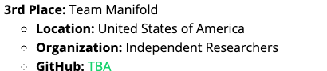

# LPCVC 2026 Track 1 Submission Closeout

Team Manifold placed **3rd** in LPCVC 2026 Track 1: Image-to-Text Retrieval. This file documents Team Manifold's implementation, submission lineage, smoke tests, and public artifact boundary.

Official result page: https://lpcv.ai/2026LPCVC/winners/



## Competition Contract

The contract is centralized in `lpcvc_contract.py`.

| Field | Value |
|-------|-------|
| Image input | `float32 (1, 3, 224, 224)` in [0, 1], RGB, CHW |
| Text input | `int32 (1, 77)` at the QNN boundary |
| ONNX text input | Native `int64`; QAI Hub compile uses `--truncate_64bit_io` |
| Tokenizer | `openai/clip-vit-base-patch32` |
| Target device | `XR2 Gen 2 (Proxy)` |
| Compile options | `--target_runtime qnn_context_binary --truncate_64bit_io` |
| Metric | Recall@Top10 |
| Latency gate | image encoder + text encoder < 35 ms |

Do not add an explicit int32-to-int64 Cast node inside the text ONNX graph. QNN handles the int32 boundary conversion through `--truncate_64bit_io`; an in-graph Cast caused earlier QNN inference failures.

## Documented Submission Lineage

The strongest documented lineage in this repo is:

1. FG-CLIP2 base image/text backbone.
2. OpenAI-BPE retokenizer for the competition text contract.
3. Fixed-224 image-side LoRA adaptation following the Schall-style sequential adaptation path.
4. ONNX export with preprocessing and text truncation baked into the graph.
5. QAI Hub compile for `XR2 Gen 2 (Proxy)`.

Primary documented compile jobs:

| Lineage | Image job | Text job | Manifest path |
|---------|-----------|----------|---------------|
| FG-CLIP2 retokenized run 1 | `jp343jqzg` | `j5q7k6wmg` | `manifests/fgclip2_base_retokenized_run1/compile_manifest.json` |
| FG-CLIP2 Schall Stage 1 | `jgzxkozk5` | `jg93ej2lg` | `manifests/fgclip2_schall_stage1/compile_manifest.json` |

Later local/compiled probes exist in `manifests/stage*_multipos*`, but generated manifest directories are intentionally gitignored. Treat those as generated job records, not source files.

## Methods

The final method is tokenizer translation plus fixed-resolution image adaptation.

Text mismatch: LPCVC supplies `openai/clip-vit-base-patch32` token IDs shaped `(B, 77)`, while FG-CLIP2 base expects its native Gemma tokenizer with roughly 256K vocabulary entries and a short-mode text path of length 64. Feeding OpenAI BPE IDs directly into the native FG-CLIP2 embedding table is therefore a vocabulary mismatch, not just a tokenizer setting.

Retokenizer module: `self_training/retokenizer_model.py` wraps a frozen FG-CLIP2 base model. It slices the contract input from `(B, 77)` to `(B, 64)`, replaces the native Gemma token embedding with a trainable OpenAI-BPE embedding table `(49408, hidden_dim)`, and replaces the short-mode position embedding with a trainable `(64, hidden_dim)` table. For FG-CLIP2 base, `hidden_dim` is read from `base_model.config.text_config.hidden_size` and is 768. The optional adapter is a residual `Linear -> GELU -> Linear` MLP at hidden dimension 768; the second linear layer is zero-initialized so the adapter starts near identity. The wrapper then calls the frozen FG-CLIP2 text encoder, final layer norm, projection head, last-token pooling, and L2 normalization.

Warm start and loss: `self_training/retokenizer_train.py` initializes each OpenAI BPE embedding row by decoding that BPE token, retokenizing the surface string with FG-CLIP2's Gemma tokenizer, and averaging the corresponding Gemma embedding rows. Tokens without a usable Gemma decomposition fall back to the Gemma unknown-token vector. The position table is warm-started from FG-CLIP2's short-mode position embedding. Training uses frozen FG-CLIP2 teacher text features generated from Gemma-tokenized captions with `walk_type="short"` and minimizes:

```python
loss = (1.0 - cosine_similarity(student_features, teacher_features)).mean()
```

Image adaptation: `self_training/schall_stage1.py` then keeps the retokenizer/text side frozen and trains attention-only LoRA adapters on the FG-CLIP2 image trunk at the deployed fixed `224x224` contract. The Stage 1 loss is symmetric image-text InfoNCE against the frozen retokenizer text features plus a KL anchor to the pre-adaptation image embeddings. The documented best Stage 1 run used rank 16, alpha 32, fixed logit scale 20.0, COCO/Flickr image-caption pairs, and fixed-resolution validation.

Export: `scripts/export_fgclip2.py` exports the image encoder with preprocessing baked into ONNX and exports `FgClip2RetokenizedTextEncoder`, which accepts OpenAI BPE token IDs `(1, 77)`, internally slices to 64, runs the trained embedding/position/adapter wrapper plus frozen FG-CLIP2 short-mode trunk, and returns normalized text embeddings.

## Ablation and Latency Table

Latency values are XR2 Gen 2 Proxy measurements where a profile artifact exists. "Not re-profiled" means the run was compiled or evaluated with `--skip-profile`, so this closeout does not claim a fresh device latency for that exact adapter checkpoint.

| Variant | Local Recall@10 | Hidden / qualified Recall@10 | Image ms | Text ms | Total ms | Decision |
|---------|------------------|-------------------------------|----------|---------|----------|----------|
| MobileCLIP2-S2 baseline | sample smoke 0.8957 | 0.5839 hidden snapshot | 13.638 | 4.307 | 17.945 | baseline sanity path only |
| FG-CLIP2 retokenized run 1, before fixed-resolution correction | COCO 0.6429 | 0.586 hidden | 18.574 | 5.729 | 24.303 | under latency gate, but local score was inflated |
| FG-CLIP2 retokenized, fixed-resolution correction | COCO 0.6117; Flickr30K 0.9820; sample 0.9056 | not submitted as separate corrected entry; hidden ceiling estimated near run 1 | 18.574 | 5.729 | 24.303 | corrected baseline for Stage 1 |
| FG-CLIP2 retokenized + Schall Stage 1 image LoRA | COCO 0.6218, +0.0101 over fixed-resolution retokenized baseline | 0.6051 hidden closeout, +0.019 over run 1 | not re-profiled | not re-profiled | not re-profiled; graph family previously profiled at 24.303 before LoRA merge | documented final submission lineage |
| Schall Stage 2 retokenizer realign | COCO 0.6062 | not submitted | not re-profiled | not re-profiled | not re-profiled | rejected; regressed vs Stage 1 |
| Schall Stage 1 v2 | COCO 0.5482 | not submitted | not re-profiled | not re-profiled | not re-profiled | rejected |
| Stage 1.5 CC12M anchor=1.0 rank=16 | COCO 0.6013 | not submitted | not re-profiled | not re-profiled | not re-profiled | rejected |
| Stage 1.5 CC12M anchor=2.0 rank=16 | COCO 0.6016 | not submitted | not re-profiled | not re-profiled | not re-profiled | rejected |
| Stage 1.5 CC12M anchor=1.0 rank=32 | COCO 0.5925 | not submitted | not re-profiled | not re-profiled | not re-profiled | rejected |

The main ablation lesson was that fixed-resolution evaluation mattered more than broader model changes. Earlier FG-CLIP2 local scores were inflated when validation bypassed the deployed `224x224` contract. Stage 1 image-side LoRA recovered about one local COCO Recall@10 point over the corrected retokenized baseline and improved hidden Recall@10 from 0.586 to 0.6051. Later combined changes such as retokenizer realignment, additional web-caption data, weaker anchoring, expanded rank, and broader training variants regressed.

## Reproduction Commands

Install:

```bash
python3 -m pip install -r requirements.txt
```

Download the LPCVC sample dataset into `dataset/`.

Restore the generated artifacts from the public Hugging Face bundle:

https://huggingface.co/jrauvola/lpcvc2026-track1-team-manifold-final

```bash
python3 scripts/fetch_submission_artifacts.py
```

Reproduce the Team Manifold submission-family validation:

```bash
python3 validate.py \
  --model fgclip2_base_retokenized \
  --retokenizer-checkpoint artifacts/submission/retokenizer/best.pt \
  --schall-stage1-adapter artifacts/submission/stage1_best \
  --fgclip2-fix-resolution \
  --datasets sample
```

Export and compile the documented submission family:

```bash
python3 scripts/export_fgclip2.py \
  --model-key fgclip2_base \
  --retokenizer-checkpoint artifacts/submission/retokenizer/best.pt \
  --schall-stage1-adapter artifacts/submission/stage1_best \
  --out-dir exported_onnx_fgclip2_schall_stage1

python3 compile_and_profile.py \
  --onnx-dir exported_onnx_fgclip2_schall_stage1 \
  --manifest-out manifests/fgclip2_schall_stage1/compile_manifest.json \
  --skip-profile
```

Run the baseline sanity check only when verifying install/data/scoring:

```bash
python3 validate.py --model mobileclip2_s2 --datasets sample
```

Export and compile the baseline scaffold:

```bash
python3 export_onnx.py --model mobileclip2_s2

python3 compile_and_profile.py \
  --onnx-dir exported_onnx_mobileclip2_s2 \
  --manifest-out manifests/compile_manifest.json \
  --skip-profile
```

Upload sample data and score QAI Hub inference:

```bash
python3 upload_dataset.py \
  --manifest-out manifests/upload_manifest.json

python3 inference.py \
  --compile-manifest manifests/compile_manifest.json \
  --upload-manifest manifests/upload_manifest.json \
  --top-k 10 \
  --manifest-out manifests/inference_manifest.json
```

Share submitted compile jobs with judges:

```bash
python3 - <<'PY'
import json
import qai_hub

manifest_path = "manifests/fgclip2_schall_stage1/compile_manifest.json"
with open(manifest_path) as f:
    manifest = json.load(f)

jobs = manifest["compile"]["jobs"]
for job_id in [jobs["image_compile_job_id"], jobs["text_compile_job_id"]]:
    qai_hub.get_job(job_id).modify_sharing(add_emails=["lowpowervision@gmail.com"])
    print("shared", job_id)
PY
```

## Smoke Test Used For Closeout

Run FAISS tests separately from Torch/WebDataset tests on macOS/Python 3.12 to avoid a native OpenMP runtime conflict.

```bash
python3 -m compileall \
  lpcvc_contract.py lpcvc_models.py export_onnx.py compile_and_profile.py \
  upload_dataset.py inference.py validate.py utils self_training scripts

python3 validate.py --list-datasets

python3 upload_dataset.py \
  --skip-upload \
  --manifest-out /tmp/lpcvc_upload_smoke_manifest.json

python3 -m pytest tests/test_faiss_index.py -q
python3 -m pytest tests -q --ignore=tests/test_faiss_index.py

python3 validate.py \
  --model mobileclip2_s2 \
  --datasets sample \
  --batch-size 8 \
  --results-out /tmp/lpcvc_validate_sample_smoke.csv
```

Closeout smoke result on 2026-05-16:

- FAISS test process: `3 passed`
- non-FAISS test process: `18 passed`
- upload dry-run: 56 images and 211 texts, contract shapes matched
- sample validation smoke: `R@10 = 0.8957`

## Public Lessons

The biggest local lesson was that evaluation must exactly match the deployment contract. Earlier FG-CLIP2 validation paths bypassed the fixed 224x224 contract and inflated local retrieval scores.

The practical closeout lesson is to keep the public repo focused on reproducibility: source code, model contract, exact QAI Hub submission path, and smoke-test evidence.

## Citation

```bibtex
@article{xie2025fgclip2,
  title={FG-CLIP 2: A Bilingual Fine-grained Vision-Language Alignment Model},
  author={Xie, Chunyu and Wang, Bin and Kong, Fanjing and Li, Jincheng and Liang, Dawei and Ao, Ji and Leng, Dawei and Yin, Yuhui},
  journal={arXiv preprint arXiv:2510.10921},
  year={2025}
}

@inproceedings{vasu2024mobileclip,
  title={MobileCLIP: Fast Image-Text Models through Multi-Modal Reinforced Training},
  author={Vasu, Pavan Kumar Anasosalu and Pouransari, Hadi and Faghri, Fartash and Vemulapalli, Raviteja and Tuzel, Oncel},
  booktitle={Proceedings of the IEEE/CVF Conference on Computer Vision and Pattern Recognition},
  year={2024}
}

@article{faghri2025mobileclip2,
  title={MobileCLIP2: Improving Multi-Modal Reinforced Training},
  author={Faghri, Fartash and Vasu, Pavan Kumar Anasosalu and Koc, Cem and Shankar, Vaishaal and Toshev, Alexander and Tuzel, Oncel and Pouransari, Hadi},
  journal={arXiv preprint arXiv:2508.20691},
  year={2025}
}
```

## Contact

For questions about this Team Manifold implementation, open an issue on this repository.

## What Is Not In This Repo

The public final repo intentionally excludes:

- private meeting notes and Discord exports
- speculative private-team commentary
- raw datasets and downloaded Hugging Face caches
- credentials, tokens, QAI Hub local state, and machine-specific secrets
- large generated ONNX, checkpoint, and QAI Hub output files

Generated artifacts should be reproduced from scripts or retrieved from the referenced QAI Hub / Hugging Face artifact records.
